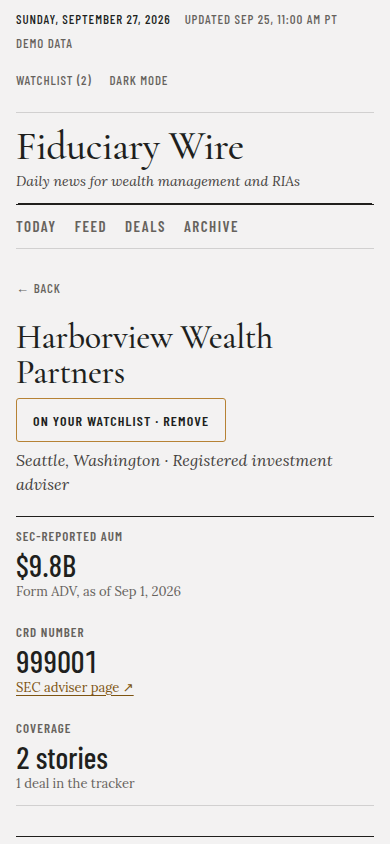
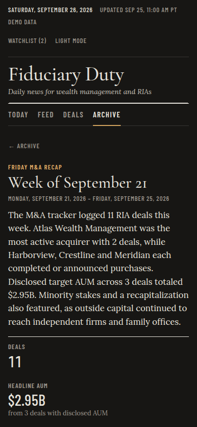

# Wealth Wire

A news wire for the U.S. wealth-management and RIA industry. It pulls headlines from trade outlets, SEC and
FINRA releases, and press-release wires. It then:
- removes duplicates and groups the same story across outlets;
- sorts stories into categories;
- recognizes SEC-registered advisers and their AUM;
- tracks RIA M&A;
- has Claude write a short digest of the day's top stories.

It runs by itself on GitHub Actions and is served as a static site by Vercel.


| Digest | Firm page (mobile) | Weekly M&A recap (dark) |
|---|---|---|
|  |  |  |

> The screenshots use the offline **demo dataset**: synthetic fixture feeds and a synthetic SEC file, shown
> with a DEMO DATA badge.

**What needs you:** [MANUAL-STEPS.md](MANUAL-STEPS.md) covers making the repo private and the optional
secrets for the Claude digest and the watchlist email. Each step is click-by-click. Without the secrets,
everything else runs and those features are skipped with a notice.

## How it works

```
GitHub Actions (weekdays ~6:00, 12:00, 17:00 PT; weekends ~8:00 PT; or "Run workflow")
  1. restore state from the `live` branch        (database, digest archive)
  2. ingest: RSS feeds, Google News RSS, wires   (+ SEC adviser file, checked monthly)
  3. digest-input → Claude (claude-code-action) → digest-finalize (validate, archive, or fall back)
  4. build the static site + private state; privacy and data-contract checks
  5. force-push one orphan commit to `live`      (Vercel deploys it)
  6. optional watchlist email (Resend)
```

- **`main`** holds the source code only.
- **`live`** is one commit, replaced every run. It contains:
  - `site/`, the public website Vercel serves;
  - `state/`, private carry-over: the SQLite DB, digest archive, `SOURCES.md` and the firm-matching report;
  - `vercel.json`, which publishes only `site/`, adds `X-Robots-Tag: noindex` and routes `/firm/<slug>`.
- The public site holds only headlines, links, outlets, dates, categories, firms, AUM, M&A rows and digest
  text. Publisher teasers and the database never leave `state/`: every build scans the output and fails if
  either shows up.

## Using the site

- **Feed** has one card per story, with every outlet that covered it. You can filter by:
  - search;
  - source;
  - region ("Pacific Northwest" = WA/OR/ID) or a single state;
  - date range;
  - category chips.
  Filters live in the URL.
- **Watchlist** lives only in your browser (`localStorage`):
  - Add firms with optional aliases. A firm's SEC-registered names are matched too.
  - Matching is case-insensitive and on word boundaries.
  - Matching stories are highlighted, pinned for 7 days, and ranked first in Top Stories and the digest.
  - **Export JSON / Import JSON** moves the list between browsers. The same file is the `WATCHLIST_JSON`
    email secret.
- **Digest** shows the top stories since the last refresh (at least 24h), ranked by outlet count, then
  recency. Once a Claude secret is set, each story gets a one-sentence summary and "Why it matters to
  advisors", under a short "Today in wealth management" opener. If Claude's output fails validation, the
  plain ranked list is shown with a link to the last good digest.
- **Archive** lists past digests and the Friday **weekly M&A recaps**: deal count, total disclosed AUM, most
  active acquirers, a Claude paragraph and the deal table.
- **M&A** has one row per deal: acquirer, target, target AUM, type, sources and confidence.
  - A matching press release raises the confidence.
  - Low-confidence rows are tinted and explain why.
  - AUM missing from the headline falls back to the SEC-reported figure, labeled with its date.
- **Firm pages** (`/firm/<slug>`) show name, city/state, SEC-reported AUM, CRD with an IAPD link, and every
  story and deal for that firm. Trending Firms links to them.
- **Sources** shows each source's method and last-run status, including the exact failure reason and how
  many wire items the wealth filter dropped.

## Sources

Listed in `sources.yaml`; live status in the Sources tab and `state/SOURCES.md` on `live`.

| Kind | Sources | Notes |
|---|---|---|
| RSS (direct or discovered) | WealthManagement.com, InvestmentNews, RIABiz, Financial Planning, Kitces, SEC press releases, FINRA, AdvisorHub | AdvisorHub is gated (headline only) and left off the public site |
| Google News RSS | ThinkAdvisor, Financial Advisor Magazine, Citywire RIA | These outlets block automated readers. Items are attributed to the outlet, with Google's redirect links left unresolved. |
| Press-release wires | PR Newswire, GlobeNewswire, Business Wire | Kept only if they mention wealth management AND name an SEC-registered firm or read as M&A or a people move |
| SEC adviser data | Monthly Form ADV extract | Checked at most every 25 days; downloaded only when newer |

Rules for every request:
- a User-Agent with the contact email;
- robots.txt respected;
- at least 2s between requests to the same host;
- 15s timeout, one retry;
- conditional GET.

It never logs in, never reads past a paywall, and never fetches article pages.

## Configuration

| File | Controls |
|---|---|
| `config.yaml` | contact email / User-Agent, timezone, politeness settings, clustering, `site:` (public-output options), `sec:` (SEC file checks) |
| `sources.yaml` | per source: `name`, `homepage`, `feed_url`, `kind` (`feed` / `google_news` / `wire`), `query`, `gated`, `listing_url`, `max_age_days`, `enabled` |
| `categories.yaml` | ordered keyword rules for categories |
| `firm_aliases.yaml` | curated brand aliases ("Vanguard", "LPL", "Merrill") mapped to SEC names |
| `firm_stoplist.yaml` | capitalized phrases the fallback firm extractor must never report |
| `prompts/digest.md` | Claude's instructions for the digest and the weekly paragraph |

A push to `main` that changes any of these triggers a refresh. That run rebuilds the site but doesn't
rewrite the digest.

## The `/digest` command (Claude Code, optional)

The scheduled workflow writes the digest. If you have Claude Code and a local copy of the data, `/digest`
does the same locally:
1. it runs `digest-input`;
2. it follows `prompts/digest.md`;
3. it runs `digest-finalize`, which applies the same validation as the workflow.

Its permissions are limited to those commands and to reading and writing files under `_work/`.

## Run it on your computer (optional)

```bash
./run.sh                                  # makes .venv, installs, ingests once, serves http://localhost:8000
python -m wealthwire --help               # all commands (ingest, build-site, serve, digest-input, …)
```

Offline demo with the fixture data (no network):

```bash
export WEALTHWIRE_HOME=demo WEALTHWIRE_NOW=2026-09-25T18:00:00Z   # fixtures are dated around this instant
python -m wealthwire ingest --fixtures tests/fixtures/demo
python -m wealthwire serve
```

## Replacing the frontend

All rendering lives in **`frontend/`** (`index.html`, `app.js`, `style.css`, `favicon.svg`). The build copies
that folder verbatim into the site root and writes the data next to it under `/data/`. A new design only has
to:

1. **Read the data.** Load the JSON files documented in [DATA-CONTRACT.md](DATA-CONTRACT.md) (schemas in
   `schemas/`) with `fetch("/data/…")`. There is no API.
2. **Handle the routes:** `/` and `/firm/<slug>`. Vercel rewrites `/firm/*` to `/index.html`, and the local
   server does the same. Query-string views (`?tab=…`) are up to you.
3. **Keep the watchlist in the browser.** Store it in `localStorage` and match it against `clusters.json`,
   using `firms/index.json` for SEC names. The current `app.js` shows the matching rules.
4. **Keep the footer note:** "Summaries written with Claude from outlet headlines." It is also available as
   `meta.footer_note`.

Replace the files in `frontend/` (any static output works; if you use a build tool, commit its output into
`frontend/`). Nothing in `wealthwire/`, `schemas/` or the workflow needs to change.

**Test locally against real data:**

```bash
python -m wealthwire state fetch _prev && python -m wealthwire state restore _prev   # pull the live DB
python -m wealthwire serve            # builds site/data from it and serves http://localhost:8000
```

Or run fully offline on the demo data (see above). `python -m pytest tests/test_site.py` checks that the
generated data still matches the contract.

## Development

```bash
pip install -r requirements.txt
python -m pytest                   # 334 tests, no network (fixture feeds + httpx MockTransport)
python scripts/screenshots.py      # Playwright: 13 views × 1440/390 × light/dark, interactions; fails on console errors
python scripts/make_fixtures.py    # regenerate the offline fixture sites
python -m wealthwire eval-firms    # firm-matching precision/recall on the 75 labeled headlines
```

- Phase 2 plan: [PLAN-PHASE2.md](PLAN-PHASE2.md).
- Every judgment call: [DECISIONS.md](DECISIONS.md).
- Results: [AUDIT-PHASE2.md](AUDIT-PHASE2.md), plus the phase 1 [AUDIT.md](AUDIT.md).
- Data contract: [DATA-CONTRACT.md](DATA-CONTRACT.md).

## Known limitations

- **Google News RSS returns HTTP 503 to GitHub's runners.** Google blocks many datacenter IP ranges. The
  spec rules out any workaround, so ThinkAdvisor, FA Magazine and Citywire stay failed on the Sources tab
  until Google serves those runners again. The code path is tested on fixtures.
- **The Business Wire feed URL currently returns an empty feed.** Business Wire publishes no stable public
  wealth-management feed. Replace `feed_url` in `sources.yaml` if you find a working category feed.
- **The wire filter is strict on purpose.** On the first live runs it kept 0 of 40 wire items. Press releases
  about wealth-management deals get through; general financial PR doesn't.
- **Firm matching is heuristic.** On 75 labeled real headlines against the real SEC file it scores
  precision 0.98 and recall 0.93. Brands that are ordinary words ("Horizon") or firms that aren't
  SEC-registered advisers (broker-dealers, Prudential) are missed. The same text as a real adviser's name
  (Luma) can mismatch. Unmatched capitalized firm names still come from a fallback extractor and are marked
  unverified, with no firm page.
- **SEC data is monthly.** AUM is the regulatory AUM from the latest file and is labeled with its date.
- **The Claude digest and the email only run once you add their secrets.** Neither was exercised live
  before handing over; see AUDIT-PHASE2.md.
- **The schedule drifts an hour in winter.** GitHub cron is UTC, anchored to Pacific Daylight Time.
- **Clustering is fuzzy title matching.** Two different stories that differ only by a proper noun can
  merge. Stories more than 72h apart never merge.
- **The watchlist is per browser.** Use Export/Import to move it; the email uses its own copy in
  `WATCHLIST_JSON`.
