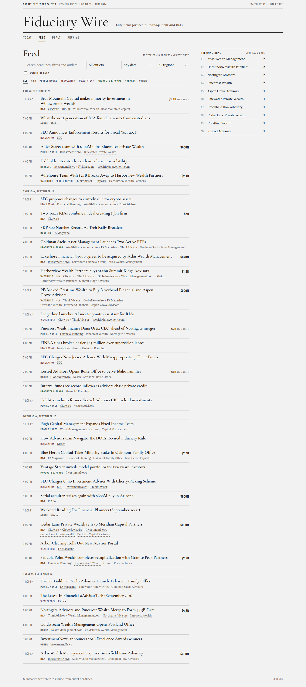
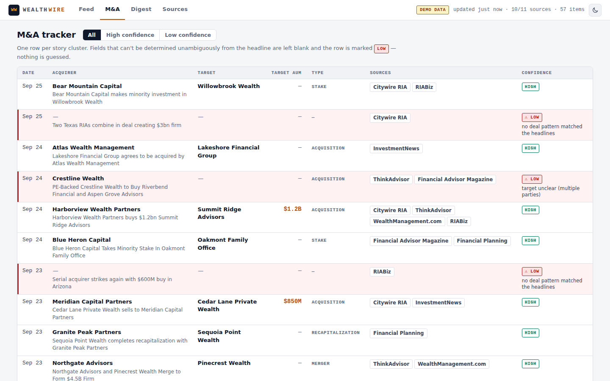
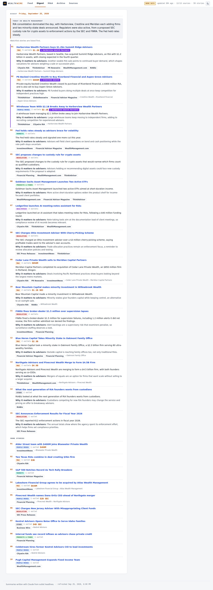
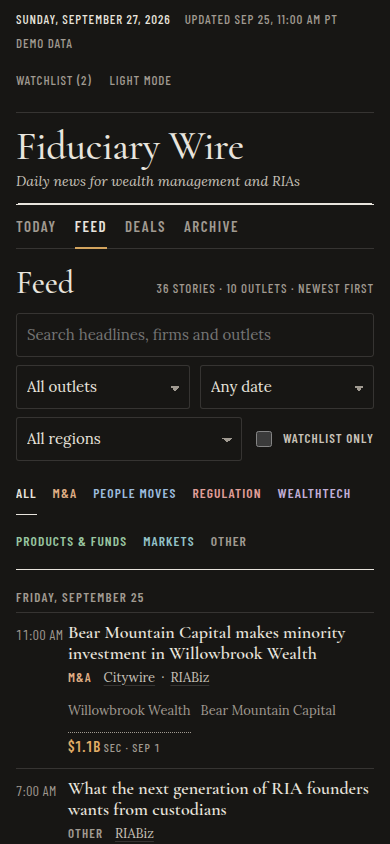

# Wealth Wire

A local news wire for the U.S. wealth management / RIA industry. It pulls headlines from trade outlets,
removes duplicates, sorts stories into categories, groups the same story across outlets, pulls out firms
and AUM, tracks RIA M&A, highlights your watchlist, and feeds a two-minute morning digest.

Everything runs on your machine. The code makes **no LLM or API calls**. It stores only headline, link,
date, source and a description of at most 300 characters, and never logs in or reads past a paywall.



| M&A tracker | Digest | Mobile (dark) |
|---|---|---|
|  |  |  |

> The screenshots use the offline **demo dataset**: synthetic fixture feeds, marked with a DEMO DATA badge
> in the UI. See [Known limitations](#known-limitations).

## Website (no terminal needed)

The easiest way to use Wealth Wire is the self-updating website:

1. **Every 3 days** (7:17am Pacific), GitHub Actions (`.github/workflows/refresh-site.yml`) runs the ingestion on GitHub's
   machines, rebuilds a static copy of the app, and force-pushes it to the **`live`** branch. The branch
   carries the database forward, so history accumulates.
2. **Vercel** serves the `live` branch. Its `vercel.json` tells Vercel to publish the `site/` folder as-is,
   with no build step.

The public page shows headlines, links to the original articles, source, date, category, firms and AUM.
Publisher descriptions and paywalled sources are left out; both are controlled by the `site:` section of
`config.yaml`. The page asks search engines not to index it (`noindex` + `robots.txt`). The watchlist is
read-only there: edit `watchlist.yaml` on github.com and the site updates within minutes, because a push
to `main` triggers a refresh. To refresh on demand, go to the Actions tab → **Refresh site** → **Run workflow**.

The `vercel.json` on `main` turns off Vercel deployments for code branches; the `live` branch has its own
`vercel.json`, which publishes `site/`. One-time Vercel setup: **Add New → Project →** import this repo → under **Settings → Environments →
Production**, set the branch to `live`. Every refresh after that deploys automatically.

## Run it on your own computer (optional)

```bash
./run.sh
```

`run.sh` needs Python 3.11 or newer. It:

1. creates `.venv/` if it's missing,
2. installs `requirements.txt`,
3. runs one ingestion (about a minute, because it waits at least 2s between requests to the same host),
4. starts the app at **http://localhost:8000**.

While the server runs, it re-ingests every 2 hours.

Other commands (`python -m wealthwire` switches to `.venv` automatically when it exists):

```bash
python -m wealthwire ingest       # one ingestion: fetch, dedupe, recompute, write SOURCES.md + new_stories.json
python -m wealthwire serve        # web app only
python -m wealthwire recompute    # re-run categories/clusters/extraction after editing the YAML rules
```

### Offline demo (no network)

```bash
WEALTHWIRE_HOME=demo python -m wealthwire ingest --fixtures tests/fixtures/demo
WEALTHWIRE_HOME=demo WEALTHWIRE_NO_BACKGROUND=1 python -m wealthwire serve
```

`WEALTHWIRE_HOME` holds the runtime data: `data/wealthwire.db`, `SOURCES.md`, `new_stories.json` and
`digests/`. `WEALTHWIRE_CONFIG` holds the YAML files. Both default to the repo root.

## Using it

- **Feed** lists one card per story, newest activity first. Each card shows every outlet that covered it
  (with links and times), the category chip, the firms mentioned, and the AUM when one is stated.
- **Search** is FTS5 full-text over headlines and descriptions, with stemming and prefix match on the last
  word. Press `/` to focus the box.
- **Filters** cover source, category (multi-select chips), date range and watchlist-only. All filter state
  lives in the URL, so views can be bookmarked and the back button works.
- **Watchlist** stories from the last 7 days are highlighted and pinned above the feed. You can add or
  remove firms in the sidebar; changes are written back to `watchlist.yaml`.
- **Trending firms** ranks firms by the number of distinct stories (not articles) mentioning them in the
  last 7 days.
- **M&A** has one row per M&A story: acquirer, target, target AUM, deal type, date, linked sources and
  confidence. Low-confidence rows are tinted red, say why, and can be filtered.
- **Digest** renders the newest `digests/YYYY-MM-DD.md`. If none exists yet, it says so and shows the top 10
  stories from `new_stories.json`.
- **Sources** shows each source's status from the last run: method, URL, item counts and the exact reason
  for any failure. The same table is in `SOURCES.md`.
- **Theme** follows your system setting. The toggle overrides it and is remembered in the browser.

## Configuration (all editable, all committed)

| file | what it controls |
|---|---|
| `config.yaml` | `contact_email` / `user_agent`, `timezone` (default America/Los_Angeles), per-host delay, timeout, retries, cluster window (72h) and threshold (70), re-ingest interval, digest fallback window |
| `sources.yaml` | per source: `name`, `homepage`, `feed_url` (blank = discover), `gated`, `listing_url` (optional fallback), `enabled` |
| `watchlist.yaml` | `firms: [{name, aliases}]`. Matching is case-insensitive on word boundaries; aliases under 3 characters are ignored |
| `categories.yaml` | ordered category rules: `any` phrases, `unless` guards, `title_only`. Plain phrases, or `re:` for a regex. First match wins |
| `firm_stoplist.yaml` | capitalized phrases the firm extractor must never report ("Private Wealth", "Financial Planning", …) |

After editing `categories.yaml`, `firm_stoplist.yaml` or the cluster settings, run `python -m wealthwire recompute`,
or just wait for the next ingestion. Derived data is always recomputed from the stored items, so rule changes
apply to history too.

### Adding a source

Add an entry to `sources.yaml`. If you know the RSS/Atom URL, put it in `feed_url`. Otherwise leave it
blank and ingestion tries, in order:

1. the configured feed,
2. a feed discovered on an earlier run,
3. `<link rel="alternate">` on the homepage / listing page,
4. `/feed`, `/feed/`, `/rss`, `/rss.xml`, `/feed.xml`, `/atom.xml`,
5. parsing the public `listing_url` (headline, link and date only).

Every non-feed fetch checks `robots.txt` first. Set `gated: true` for paywalled outlets; only headline, link,
date and source are then stored.

## The `/digest` command (Claude Code)

`.claude/commands/digest.md` tells Claude Code to:

1. run `python -m wealthwire ingest`,
2. read `new_stories.json`: the stories first seen since `digests/.last_digest` (or the last 24h), ranked by
   watchlist hits, then number of outlets, then recency,
3. write `digests/YYYY-MM-DD.md` with a **Watchlist Hits** section first (or "None today"), then the top 10
   stories. Each story gets its linked sources, a one-sentence summary based only on the headlines and
   descriptions in the file, and a "Why it matters to advisors:" line,
4. update `digests/.last_digest`.

Permissions are pre-approved for exactly those actions and nothing else: the ingest command, reading
`new_stories.json`, and writing under `digests/`. They are listed in both `.claude/settings.json` and the
command's `allowed-tools` frontmatter.

> **One-time step:** Claude Code ignores a project's `.claude/settings.json` allow rules until you have
> trusted the folder. Run `claude` once in the repo and accept the trust prompt. The command's own
> `allowed-tools` frontmatter already covers `/digest`, so it works either way. It was verified headless:
> `claude -p "/digest"` finished with 0 permission denials.

### Scheduling it as a weekday routine

cron (macOS or Linux), 6:44am on weekdays:

```cron
44 6 * * 1-5  cd /path/to/Wealth-Wire && /usr/local/bin/claude -p "/digest" >> digests/cron.log 2>&1
```

Use the full path to `claude` (`which claude`), because cron has a minimal `PATH`. On macOS, give cron
(or your terminal) Full Disk Access if the repo is under a protected folder. A launchd agent or the
scheduled-tasks feature of the Claude desktop app works the same way. The job only needs to run
`claude -p "/digest"` from the repo folder. Open the Digest tab afterwards (the server doesn't have to run
for the digest to be written).

## Replacing the frontend

All rendering lives in **`frontend/`** (`index.html`, `app.js`, `style.css`, `favicon.svg`). The build copies
that folder verbatim into the site root and writes the data next to it under `/data/`. A new design only has
to:

1. **Read the data.** Load the JSON files documented in [DATA-CONTRACT.md](DATA-CONTRACT.md) (schemas in
   `schemas/`) with `fetch("/data/…")`. There is no API.
2. **Handle the routes:** `/` and `/firm/<slug>`. Vercel rewrites `/firm/*` to `/index.html`, and the local
   server does the same. Query-string views (`?tab=…`) are up to you.
3. **Keep the watchlist in the browser.** Store it in `localStorage` and match it against `clusters.json`,
   using `firms/index.json` for SEC names. The current `app.js` shows the matching rules.
4. **Keep the footer note:** "Summaries written with Claude from outlet headlines." It is also available as
   `meta.footer_note`.

Replace the files in `frontend/` (any static output works; if you use a build tool, commit its output into
`frontend/`). Nothing in `wealthwire/`, `schemas/` or the workflow needs to change.

**Test locally against real data:**

```bash
python -m wealthwire state fetch _prev && python -m wealthwire state restore _prev   # pull the live DB
python -m wealthwire serve            # builds site/data from it and serves http://localhost:8000
```

Or run fully offline on the fixture data:
`WEALTHWIRE_HOME=demo python -m wealthwire ingest --fixtures tests/fixtures/demo && WEALTHWIRE_HOME=demo python -m wealthwire serve`.
`python -m pytest tests/test_site.py` checks that the generated data still matches the contract.

## Development

```bash
pip install -r requirements.txt
python -m pytest                   # 238 tests, no network: saved fixture feeds + httpx MockTransport
python scripts/screenshots.py      # Playwright: 9 views × 1440/390 × light/dark → screenshots/, fails on console errors
python scripts/tune_cluster.py     # print clustering scores for tests/fixtures/cluster_pairs.yaml
python scripts/make_fixtures.py    # regenerate the offline fixture site
```

Architecture, schema and test plan are in [PLAN.md](PLAN.md). Every judgment call is in
[DECISIONS.md](DECISIONS.md). The acceptance audit is in [AUDIT.md](AUDIT.md).

## Known limitations

- **Live sources were not reachable from the environment this was built in.** Its egress proxy returned
  403 for every news domain, so [SOURCES.md](SOURCES.md) currently records `network proxy refused connection
  (403 Forbidden)` for all 11 sources. Each network path (configured RSS, `<link rel=alternate>`
  discovery, common paths, listing fallback, robots disallow, gated, conditional GET) is exercised against
  fixture sites in the tests. The seeded feed URLs follow each platform's known patterns but are unverified.
  Your first `./run.sh` will show the real status per source; fix any failing one in `sources.yaml`. Likely
  problems on a real network:
  - bot protection (Cloudflare/Akamai 403s),
  - JavaScript-rendered listing pages with no parseable headlines,
  - `robots.txt` disallowing the listing pages. FINRA and some publishers disallow crawling news sections;
    that is recorded as the failure reason and respected.
- **Extraction is heuristic.** Categories are keyword rules. Firm names are capitalized spans that contain
  a firm word ("Wealth", "Capital", "Advisors", …), so names without one ("Hightower", "LPL") are only
  found through the watchlist or M&A patterns. AUM needs a `$` figure with asset context nearby, so fines,
  prices and funding rounds are excluded. The M&A table reads headline grammar only; anything ambiguous is
  left blank and marked low confidence instead of guessed.
- **Clustering is fuzzy title matching.** Two different stories that differ by a single proper noun (e.g.
  two teams with identical AUM joining the same firm on the same day) can merge. That case is documented
  in `tests/fixtures/cluster_pairs.yaml`. Stories more than 72h apart never merge.
- **Watchlist aliases are literal.** The "Goldman" alias you asked for also matches a person named Goldman.
- **Dates without a machine-readable timestamp** (some listing pages) fall back to the fetch time and are
  flagged `published_estimated`.
- **Single user, no auth.** The server binds to 127.0.0.1. Don't expose it to a network.
